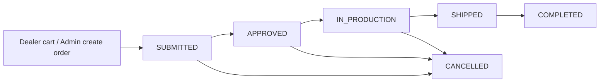

# Ormsby Dealer Portal — Project Overview

A practical guide to how the portal works from a **dealer** and **admin** point of view.

**Production app:** [https://dealer-portal-iota.vercel.app](https://dealer-portal-iota.vercel.app)  
*(Some email/setup links may also reference `ormsbydealers.vercel.app` depending on Cloud Functions config.)*

---

## 1. What this product is

The **Ormsby Dealer Portal** is a B2B ordering system for Ormsby Guitars dealers and distributors.

| Audience | What they do |
|----------|----------------|
| **Dealers** | Log in, browse the active catalogue, see their account pricing (discount off RRP), place purchase orders, track order status, revise lines where allowed, and download order PDFs. |
| **Admins (Ormsby staff)** | Manage dealer accounts, guitars, availability, RRP pricing, orders, revisions, manufacturer reports, branding, email templates, and FX rates. |
| **Public catalogue recipients** | Use shareable Run 19 links (no login) to quick-order at a fixed % off RRP and submit by email. |

This is **not** a consumer webshop: there is no card payment checkout. Orders are purchase-order style; invoicing is handled outside the cart (or via an invoice file uploaded by admin).

---

## 2. Tech stack (short)

| Layer | Technology |
|-------|------------|
| App | Next.js 15 (App Router), React, TypeScript, Tailwind |
| Auth / data | Firebase Auth, Firestore, Firebase Storage |
| Server logic | Firebase Cloud Functions |
| Hosting | Vercel |
| Email | Mailgun (with SMTP fallback) |
| FX | Frankfurter API (`/api/fx/latest`) |
| PDFs | jsPDF |

---

## 3. Roles & access

| Role | Access |
|------|--------|
| **ADMIN** | Full `/admin` console. Can also **View dealer dashboard** on an account (read-only preview for troubleshooting). |
| **DEALER** | Logged-in portal: dashboard, guitars, cart, orders, settings. Bound to one Firestore `accountId`. |
| **DISTRIBUTOR** | Used as an **account type** (and on registration requests). Logged-in experience is the same portal as dealers. Separately, a **public distributor catalogue** exists at 50% off (no login). |

Unauthenticated users can still use public catalogue routes and the landing/login/register pages.

---

## 4. Dealer point of view

### 4.1 Getting access

1. Ormsby creates (or approves) an **account** and auth user.
2. Dealer receives a **setup / claim link** (email or copied by admin).
3. Dealer opens `/claim-account`, sets a password, then signs in at `/login`.

Dealers can also **register** at `/register` (dealer or distributor request). Admin must approve before they can use the portal.

Related doc: [`docs/DEALER-CLAIM-ACCOUNT.md`](./DEALER-CLAIM-ACCOUNT.md)

### 4.2 After login — main areas

| Area | Path | Purpose |
|------|------|---------|
| Dashboard | `/dashboard` | Snapshot: recent orders, account info, quick links, featured guitars. |
| Guitars | `/dealer` | Browse **ACTIVE** guitars (search / series filters). |
| Guitar detail | `/dealer/guitars/[guitarId]` | Choose options (colour, strings, etc.), see availability, add to cart. |
| Cart | `/cart` | Review lines, update qty, remove closed items if any. |
| Checkout | `/checkout` | Shipping, PO, notes, accept T&Cs → submit order. |
| Orders | `/orders`, `/orders/[orderId]` | Track status, revise where allowed, download PDF. |
| Settings | `/settings` | Company details, shipping/billing, display currency, estimated tax/tariff (reference only). |

### 4.3 Pricing (what dealers see)

- Catalogue prices are shown as **dealer price = RRP × (1 − account discount %)**.
- Example: RRP $2,595 with **35% off** → dealer pays $1,686.75 (AUD on the order lines).
- Account **display currency** (USD, EUR, etc.) is for on-screen estimates only; **order lines are locked in AUD** when submitted.
- FX rates under totals are **indicative** (not invoice rates).

### 4.4 Availability badges

| Badge | Meaning for the dealer |
|-------|-------------------------|
| **In stock** | Available to order. |
| **Pre-order** | Pre-sale open (optional ETA shown). |
| **Batch** | Tied to a named batch (optional ETA). |
| **Closed** | Still listed, but **cannot be ordered** (pre-sales closed). |

`INACTIVE` guitars are hidden from dealers entirely.

### 4.5 Placing an order

1. Add configured guitars to the cart.
2. Review cart (remove anything marked closed).
3. Checkout: shipping address, optional PO / notes, accept Terms.
4. Submit → order status **SUBMITTED**.
5. Confirmation page + (if enabled) confirmation email.

### 4.6 Order statuses (dealer view)

```
DRAFT → SUBMITTED → APPROVED → IN_PRODUCTION → SHIPPED → COMPLETED
                                                      ↘ CANCELLED (any time, by admin)
```

| Status | Typical dealer actions |
|--------|-------------------------|
| **SUBMITTED / APPROVED** | Can often **add guitars directly** to the order (same account). |
| **IN_PRODUCTION / SHIPPED / COMPLETED** | Changes go through **add/remove requests** that Ormsby must approve. |
| Any active order | Download **Order PDF**; see FX estimates on the summary. |

### 4.7 Order revisions (dealer)

When the dealer changes an early-stage order and needs Ormsby to review:

1. Dealer edits lines / adds guitars where allowed.
2. Dealer clicks **Submit updated order to Ormsby**.
3. Order is marked for Ormsby review (`pendingOrmsbyRevisionReview`).
4. Admin either **approves** or **proposes changes** back.
5. If admin proposes changes, dealer can **Accept** or **Request changes**.

Related doc: [`docs/ORDER-REVISION-PROCESS.md`](./ORDER-REVISION-PROCESS.md)

### 4.8 Order PDF

Dealers (and admins) can download a PDF of the order: line items, options, AUD totals, and approximate FX.  
Related doc: [`docs/ORDER-FORM-PDF.md`](./ORDER-FORM-PDF.md)

---

## 5. Admin point of view

### 5.1 Admin home & navigation

| Path | Purpose |
|------|---------|
| `/admin` | Overview: stats, pending account requests, recent order activity. |
| `/admin/accounts` | Dealer/distributor accounts. |
| `/admin/guitars` | Catalogue CRUD. |
| `/admin/pricing` | RRP / price documents per guitar. |
| `/admin/orders` | All dealer orders (filters, thumbnails, manufacturer report). |
| `/admin/settings` | Branding, email, terms, FX refresh, notifications. |

### 5.2 Accounts

For each account admins can:

- Create the account and auth user (welcome / claim email).
- Set **discount % off RRP**, currency, territory, contact details, tier (legacy).
- **View dealer dashboard** — gold banner, read-only preview of that dealer’s portal (dashboard, guitars, orders) for troubleshooting. Cart/checkout stay disabled; place orders via **Create order for account**.
- **Create order for account** — place a PO on their behalf (browse catalogue → draft → submit).
- **Copy email link** / resend login / setup email.
- Approve or reject **registration requests**.

**Important:** Dealer dashboard preview is read-only (cart disabled). To allocate guitars to a dealer, use **Create order for account** or open an existing order and **Add guitar**.

### 5.3 Guitars

- Create / edit: SKU, name, series, **run**, images, specs, configurable options (with RRP adjustments / SKU suffixes).
- **Status:** `ACTIVE` (visible) or `INACTIVE` (hidden from dealers).
- **Availability** (on edit):

| Value | Effect |
|-------|--------|
| `PREORDER` / `IN_STOCK` / `BATCH` | Dealers can order (subject to ACTIVE). |
| `CLOSED` | Dealers **cannot** order; listing can remain visible. Admins can still add to orders manually. |

Optional fields: ETA date, batch name, qty available / allocated (stored for reference; see limitations).

### 5.4 Pricing

- Admin maintains **RRP** (and related price doc fields) per guitar.
- Dealer net price at checkout is computed from **account discount %**, not from editing each dealer’s line price in the catalogue.
- On an order, admin can still edit **unit price / qty** per line and recalculate from current RRP + discount.

### 5.5 Orders

On **Admin → Orders**:

- Search / filter by status (including a pending queue of Submitted + Approved).
- **Thumbnails** of guitars on each card for quick scanning.
- Open an order to:
  - Change **status** (Submitted → Approved → In production → Shipped → Completed / Cancelled).
  - Edit line qty and unit price; remove lines; **recalculate prices**.
  - **Add guitar** (browse → configure → add to this order).
  - Set ETA; upload invoice PDF.
  - Approve / reject dealer **add** and **remove** requests.
  - Handle revisions: **Approve revision** or **Submit proposed changes to dealer**.
- **Manufacturer report:** aggregate demand by guitar / options (filter by status and run), with CSV export.

### 5.6 Settings

- Site branding (name, logo, colours, support email).
- Mailgun / SMTP and notification toggles (order created, status change, revision emails, etc.).
- Email body/subject templates.
- Terms & Conditions template (shown at dealer checkout).
- **Refresh FX rates** for indicative conversions across the app.

---

## 6. Public Run 19 catalogues (no login)

Shareable links for pre-sales / runs without portal accounts:

| Audience | Discount | URL |
|----------|----------|-----|
| Dealer | **40% off RRP** | `/catalogue/run-19` |
| Distributor | **50% off RRP** | `/catalogue/run-19/distributor` |

**Production examples:**

- https://dealer-portal-iota.vercel.app/catalogue/run-19  
- https://dealer-portal-iota.vercel.app/catalogue/run-19/distributor  

### Features

- Cards per colour; quick order (strings + qty) or configure wizard.
- View specs popup (from the guitar listing).
- Order drawer / sidebar with FX converter (AUD → USD/EUR/GBP/CAD, indicative).
- Submit by email → Ormsby receives the request; submitter gets a confirmation copy.
- Prices are **recalculated server-side**; client prices are not trusted.
- Does **not** create a normal portal order under a dealer account (email intake workflow).

---

## 7. Order lifecycle (end-to-end)



1. Order created (dealer checkout or admin on behalf of account).
2. Admin advances status and may attach invoice / ETA.
3. Dealer may revise early; later stages use request workflows.
4. Revision flags drive admin ↔ dealer confirmation emails when enabled.
5. PDF available throughout for factory / dealer reference.

---

## 8. Key concepts & terminology

| Term | Meaning |
|------|---------|
| **Account** | Dealer/distributor company record (`discountPercent`, currency, shipping, etc.). |
| **RRP** | Recommended retail price (AUD base for pricing maths). |
| **Dealer price** | RRP after account discount %. |
| **Run** | Free-text production run label on a guitar (e.g. “Run 19”, “Run 21”). |
| **CLOSED** | Availability state: visible, not orderable by dealers. |
| **View dealer dashboard** | Admin preview of that dealer’s portal (read-only). |
| **Public catalogue** | No-login Run 19 order form (40% / 50%). |

---

## 9. Limitations / non-goals

Be clear with stakeholders about what the portal does **not** do yet:

- **No real-time stock allocation** — `qtyAvailable` / `qtyAllocated` are not enforced when orders are placed (no automatic decrement / oversell block).
- **No payment gateway** — deposits/invoices are handled outside checkout (or via uploaded invoice).
- **FX is indicative only** — not used as the invoiced rate unless your commercial process says otherwise.
- **Distributor login** is not a separate product; the main difference today is account typing + the public 50% catalogue.
- **Public catalogue submissions** are email-based, not full portal orders tied to an account.
- There is **no full audit log** of every line edit (revision flags + emails are the main trail).

---

## 10. Related docs in this repo

| Doc | Topic |
|-----|--------|
| [`DEALER-CLAIM-ACCOUNT.md`](./DEALER-CLAIM-ACCOUNT.md) | How dealers set their password / claim access |
| [`ORDER-REVISION-PROCESS.md`](./ORDER-REVISION-PROCESS.md) | Dealer ↔ Ormsby revision workflow |
| [`ORDER-FORM-PDF.md`](./ORDER-FORM-PDF.md) | Order PDF contents and FX notes |
| [`../README.md`](../README.md) | Developer / setup notes |
| [`../DEPLOY_VERCEL.md`](../DEPLOY_VERCEL.md) | Vercel deploy |

---

## 11. Quick “how do I…?” cheat sheet

### Dealer
| Goal | Where |
|------|--------|
| Browse & order | Guitars → detail → cart → checkout |
| See my discount | Guitar price + “% off”; account discount set by admin |
| Track an order | Orders → open order |
| Change an open order | Order detail (add lines / submit update to Ormsby) |
| Get a PDF | Order detail → Order PDF |

### Admin
| Goal | Where |
|------|--------|
| Onboard a dealer | Accounts → create / approve request → copy claim link |
| See what a dealer sees | Account → **View dealer dashboard** (then Exit preview) |
| Allocate guitars to a dealer | Account → **Create order for account**, *or* Orders → open order → **Add guitar** |
| Close pre-sales | Guitars → Edit → Availability **CLOSED** |
| Hide a guitar completely | Guitars → Status **INACTIVE** |
| Change order status / invoice | Orders → order detail |
| Share Run 19 form | `/catalogue/run-19` (40%) or `/catalogue/run-19/distributor` (50%) |
| Factory demand report | Orders → Manufacturer report |

---

*Last updated to match the dealer-portal codebase (Run 19 public catalogues, CLOSED availability, admin add-to-order, order list thumbnails).*
